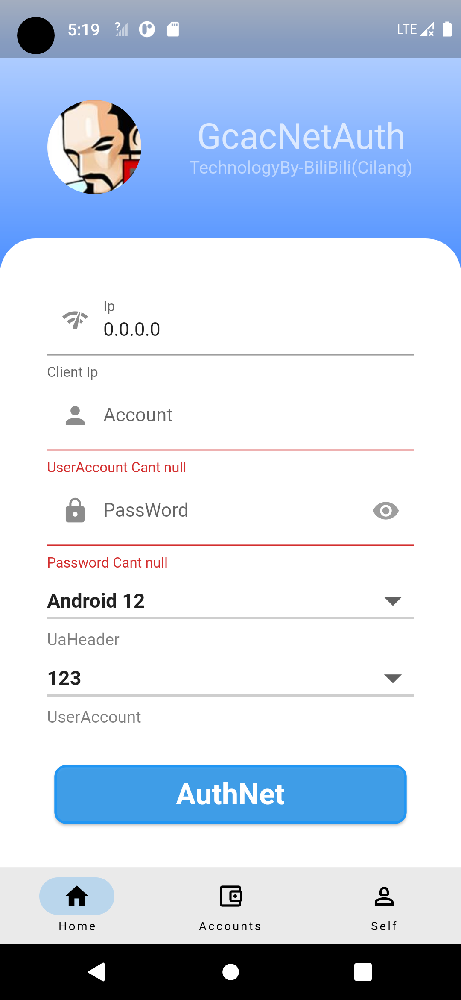
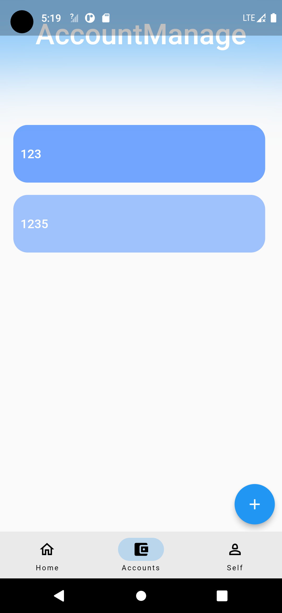

<div align=center></br></br></br>

<center> </center>

#  <center>  gaca_net_auth</center>

###### <center>Introduce</center>

###### 							
            

<center>use flutter implement</center>

</div>

Debug

``````makefile
cd lib
flutter pub get
flutter run
``````

App directory

`````dart
-/bean(object)
-/components(ui)
    ./main_sreen(loginpage)
	./modaldailog(modal components)
    ./network_sreen(account manage)
    home_sreen.dart 
-/constant(style)
-/controller
    ./main....er(nothing here)
    ./net_handle(net auth function)
-/utils
    ./regex(regex utils)
    ./sqlite(sqlite utils)
    	

`````

Get Start

```dart
// Get the ip address
//   ->./lib/
//		->controller/
//			->net_handle/
//				->getip.dart 

// Ip regex
//	->./lib/
//		->utils/
//			->regex/
//				->vaildIp.dart line 1
bool validateIP(String ip) {
  // 10.34.1.1 true 10.35.1.1 flase
  final RegExp ipRegex = RegExp(r'^10\.34\.(\d+)\.(\d+)$');
  if (!ipRegex.hasMatch(ip)) {
    return false;
  }

  print('IP is valid');
  return true;
}

// Refersh components
//	->./lib/
//		->components/
//			->main_sreen/
//				->main_sreen.dart  line 39
void initState() {
    //some context
    if (authIp == "") {
      Future<String> response = getIp(_ipController);
    }
  }

// Auth Button
//	->./lib/
//		->components/
//			->main_sreen/
//				->main_sreen.dart  line 352
onPressed: () async {
    //some context
    String url = 'http://10.95.254.8/quickauth.do';
    AuthUser netAuth = AuthUser(account, passWord, authIp, ua);
    bool _scLabel =await netAuth.authNet(url, context);
    if (_scLabel) {
        addAccount();
        setState(() {
            refreshAccount();
                    });
    }
}
// Auth Net 
//	->./lib/
//		->controller/
//			->net_handle/
//				->auth_net.dart  line 41


```


### App View



<center>Login page</center>



<center>Account mange page</center>

### Donate

Thank ur supprt

| <center>微信</center>                            | <center>支付宝</center>                       |
| ------------------------------------------------ | --------------------------------------------- |
| <center></center> | <center></center> |


### Contact 

- [bilibili](https://space.bilibili.com/433915419)
- [twitter]()
- [slack]()
- [discord]()
